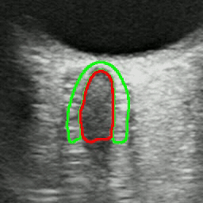
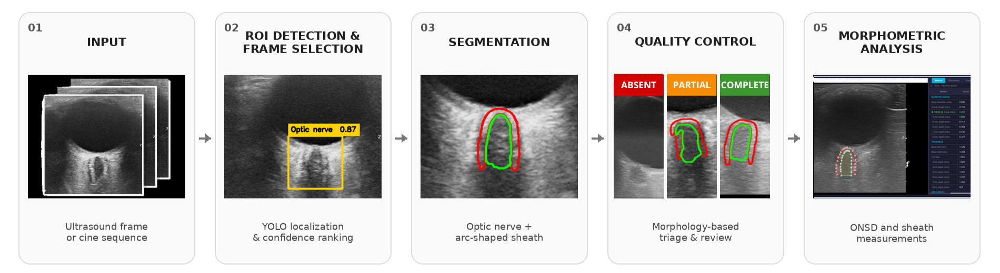
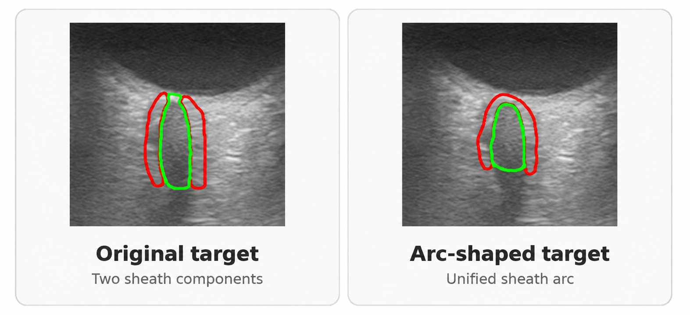
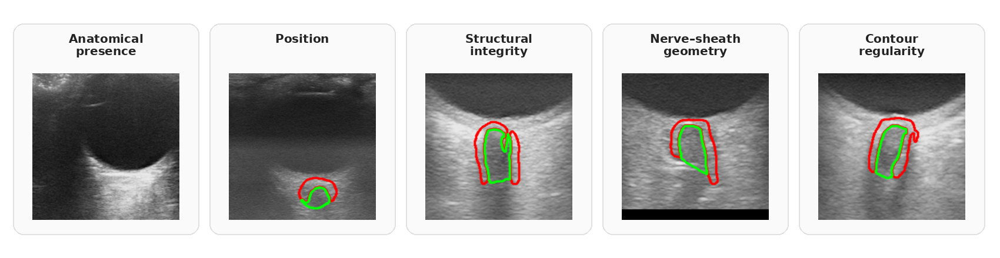

# Generalizable Ultrasound Optic Nerve Sheath Segmentation with Physiology-Aware Quality Control

**MSc thesis · Biomedical Engineering, Politecnico di Torino**  
*Research collaboration with Charité – Universitätsmedizin Berlin and Universität Innsbruck*

  

  <em>Example of automated optic nerve and sheath segmentation on a transorbital ultrasound sequence.</em>

> **Research portfolio — no source-code release.**  
> This page showcases the workflow and selected visual material from my MSc thesis. Source code, trained models, datasets, detailed training configurations and unpublished quantitative results are not shared publicly at this stage, as the work is currently being prepared for a subsequent scientific publication.

## Overview

Transorbital B-mode ultrasound can be used to assess the optic nerve sheath diameter (ONSD), a potential non-invasive indicator of intracranial pressure.

However, the analysis can be affected by several sources of variability, including frame selection, unclear anatomical boundaries and operator-dependent measurement.

My MSc thesis focused on extending an ultrasound analysis workflow with **automated region-of-interest detection, video frame selection, deep learning segmentation and anatomy-aware quality control**, supporting a more standardized ONSD assessment pipeline.

The developed components were designed for use within the **[OPEN ONS Toolbox](https://github.com/KR616/OpenOpticNerveSheathToolbox)** and were subsequently incorporated into the toolbox workflow.

---

## End-to-End Workflow

The framework integrates:

- **ROI detection & video frame selection:** YOLO-based localization of the optic nerve region and confidence-based ranking of relevant frames from ultrasound cine sequences.
- **Deep learning segmentation:** segmentation of the optic nerve and surrounding sheath using a U-Net++-based architecture.
- **Anatomy-aware quality control:** morphological analysis of predicted masks to identify anatomically inconsistent or unreliable segmentations.
- **Morphometric analysis:** reviewed segmentation outputs can be used for downstream ONSD and sheath measurements.

---

## Segmentation Target & Fine-Tuning

A central part of the work involved adapting the segmentation target to represent the optic nerve sheath as a **continuous arc connected to the globe**.

Compared with the original representation, the redesigned target provides a more explicit anatomical reference for subsequent morphometric analysis.

The selected segmentation model was then fine-tuned to this updated representation.

Detailed training configurations, experimental comparisons and quantitative results are intentionally not reported here, as they are part of ongoing scientific work.

---

## Anatomy-Aware Quality Control

The segmentation output is followed by a deterministic morphology-based quality-control stage.

The QC evaluates aspects including:

- anatomical presence;
- positioning;
- structural integrity;
- nerve–sheath geometry;
- contour regularity.

Predictions are then routed according to their morphological consistency, allowing unreliable outputs to be excluded and uncertain cases to be prioritized for expert review before morphometric analysis.

The QC system is designed to **support expert evaluation rather than replace clinical judgment**.

---

## OPEN ONS Toolbox

This thesis was developed within the **[OPEN ONS Toolbox](https://github.com/KR616/OpenOpticNerveSheathToolbox)**, an open-source platform for optic nerve sheath ultrasound analysis.

### My contribution

As part of my MSc thesis, I developed the main components of the **automated deep learning segmentation workflow** used for optic nerve sheath ultrasound analysis.

My contribution includes:

- **YOLO-based ROI detection** for automatic localization of the optic nerve region;
- **confidence-based frame selection** for ultrasound cine sequences;
- development, optimization and **fine-tuning of the optic nerve and sheath segmentation model**;
- introduction of an **arc-shaped sheath representation** to provide a more anatomically consistent segmentation target;
- development of an **anatomy-aware quality-control module** to assess segmentation morphology and identify unreliable predictions;
- preparation of the code and trained model weights required for incorporation into the OPEN ONS workflow.

The resulting components were subsequently **integrated into the OPEN ONS Toolbox by Kai Riemer**, enabling their use within the existing annotation, visualization and morphometric-analysis workflow.

The toolbox supported the project across the full annotation and evaluation workflow. It was first used to **create and review the manual reference masks**, which were subsequently used for the development and fine-tuning of the segmentation models.

Once the resulting models were incorporated into the OPEN ONS Toolbox, the toolbox was used to **automatically segment the optic nerve and sheath** and to extract the morphometric parameters associated with the automated masks.

These measurements were then used to perform the **manual-vs-automatic comparisons** employed to evaluate the performance of the automated pipeline.

The OPEN ONS Toolbox is a broader collaborative project and remains available through its original repository:

👉 **[OPEN ONS Toolbox](https://github.com/KR616/OpenOpticNerveSheathToolbox)**

The toolbox source code is publicly available. Trained models and model weights are not distributed directly and, as specified by the project maintainers, can be requested separately.

---

## Conference Presentation

**Generalizable Ultrasound Optic Nerve Sheath Segmentation with Physiology-Aware Quality Control**

Susanna Marricchi · Lorena Jud · Kai Riemer · Kristen M. Meiburger

Presented at the **2026 IEEE International Ultrasonics Symposium (IUS)**  
Raleigh, North Carolina, USA.

---

## Technologies

`Python` · `PyTorch` · `U-Net++` · `YOLO` · `OpenCV` · `NumPy` · `SciPy` · `Albumentations`

---

## Code & Data Availability

The thesis-specific source code, annotated datasets, trained weights, detailed training configurations and unpublished quantitative results are **not publicly available at this stage**, as the work is currently being prepared for a subsequent scientific publication.

This repository is intended as a visual and technical overview of the project and of my contribution to the research workflow.

The underlying [**OPEN ONS Toolbox**](https://github.com/KR616/OpenOpticNerveSheathToolbox) is publicly available through its original repository, while trained models and model weights are distributed separately by request.
